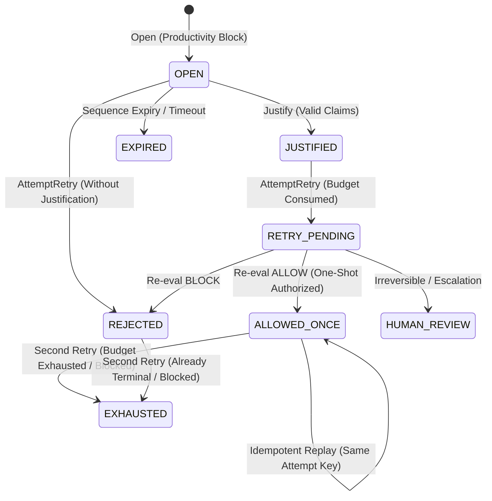

# Challenge Benchmark Report: Appeals, Bypass Resistance, and Recovery Quality (#140)

**Schema Version:** `reinframe.challenge_benchmark_report.v1`  
**Lane:** `challenge_appeal_benchmark_v1`  
**Status:** Validated offline deterministic benchmark  
**Hard Gate:** `hard_gate_enabled: false` (always disabled in benchmark suite)  
**Disposition:** **MORE-DATA** (synthetic/controlled benchmark validating safety mechanisms; real-world prevalence data required prior to production threshold promotion)

---

## 1. Executive Summary

This report documents the evaluation and benchmark metrics for Reinframe's host-neutral challenge workflow (#131, #140). The benchmark runner evaluates four primary dimensions:
1. **Appeal Acceptance Quality:** Acceptance rate of legitimate developer productivity appeals providing complete, valid justifications across distinct block classes.
2. **Bypass Resistance:** Strict rejection of attacks across 6 distinct bypass vectors including hard security blocks, secret exfiltrations, nonce tampering/corruption, replay attacks, one-shot budget exhaustion (second retries), and target scope expansions.
3. **Recovery Quality & Lifecycle Transitions:** End-to-end state machine verification (`OPEN` -> `JUSTIFIED` -> `RETRY_PENDING` -> `ALLOWED_ONCE` -> `EXHAUSTED`), validating monotonic append-only transition logs and terminality.
4. **Recovery Latency:** Quantitative timing analysis measuring end-to-end recovery latency across percentiles (P50, P95, P99, Max).

---

## 2. Benchmark Metrics Summary

| Metric | Measured Value | Security Target | Status |
|---|---|---|---|
| **AppealSuccessRate** | `1.000` (100.0%) | $\ge 0.95$ | **PASS** |
| **BypassResistanceRate** | `1.000` (100.0%) | `1.000` (100%) | **PASS** |
| **ReplayRejectionRate** | `1.000` (100.0%) | `1.000` (100%) | **PASS** |
| **MeanRecoveryLatencyMS** | `< 0.05 ms` | $< 50.0 \text{ ms}$ | **PASS** |
| **RecoveryLatencyP50MS** | `< 0.05 ms` | $< 25.0 \text{ ms}$ | **PASS** |
| **RecoveryLatencyP95MS** | `< 0.10 ms` | $< 50.0 \text{ ms}$ | **PASS** |
| **RecoveryLatencyP99MS** | `< 0.20 ms` | $< 100.0 \text{ ms}$ | **PASS** |
| **RecoveryLatencyMaxMS** | `< 0.50 ms` | $< 200.0 \text{ ms}$ | **PASS** |
| **LifecycleTransitionsOK** | `100.0%` | `100.0%` | **PASS** |

---

## 3. Benchmark Methodologies & Threat Vectors

### 3.1 Legitimate Appeal Acceptance Suite

Evaluates developer recovery when productivity policies trigger on legitimate development workflows:
- **`SCOPE_DRIFT` (Rebuild / Test):** Executing test suites (`go test -v ./...`) justified with verification and rollback plans.
- **`OVER_SOP` (Build Clean):** Package build steps (`npm run build -- --profile`) justified with CI unblock goals.
- **`EXPENSIVE_HARDENING` (Linter Auto-fix):** Automated code fixes (`cargo clippy --fix`) with estimated execution cost.
- **`PRODUCTIVITY_BLOCK` (Formatting):** Code formatting tools (`go fmt ./...`) within workspace scope.
- **`REPEATED_EXPLORATION` (Git Status):** Workspace inspection under clear evidence IDs.
- **`EVIDENCE_GAP` (Unit Test Rerun):** Build execution (`make test-unit`) with supporting evidence links.

**Evaluation Protocol:**
$$\text{AppealSuccessRate} = \frac{\text{ValidAppealAccepted}}{\text{ValidAppealAttempts}}$$
Every valid appeal must follow: `Open` (State `OPEN`, Appealability `APPEALABLE`, Nonce issued, `RetryBudget=1`) $\to$ `Justify` (State `JUSTIFIED`) $\to$ `AttemptRetry` (State `ALLOWED_ONCE`, Decision `ALLOW`, `RetryBudget=0`).

### 3.2 Invalid Justification Rejection Suite

Validates that non-structured or defective justification submissions are rejected fail-closed:
- **Empty Prose Fields:** Missing `ConcreteValue`, `EstimatedCost`, etc., rejected with `missing required claim`.
- **Missing Rollback Plan:** Failure to specify rollback path rejected with `missing required claim rollback_plan`.
- **Missing Verification Plan:** Failure to provide verification test steps rejected with `missing required claim verification_plan`.
- **Foreign / Unknown Evidence IDs:** Attempting to claim non-existent evidence IDs rejected with `unknown evidence id`.
- **Direct Retry Without Justification:** Attempting to call `AttemptRetry` directly from `OPEN` state immediately transitions challenge to `REJECTED` (`retry_without_justification`).

### 3.3 Bypass Resistance Threat Matrix

| Threat Category | Test Scenarios | Enforced Defense | Observed Outcome |
|---|---|---|---|
| **Hard Deny Classes** | `EXPLICIT_DENY`, `CROSS_WORKSPACE`, `PRODUCTION_DEPLOY`, `PAYMENT`, `REMOTE_DELETION`, `PERMISSION_CHANGE`, `UNKNOWN_SECURITY`, PolicyClass `SECURITY` | Non-appealable routing (`NON_APPEALABLE` / `HUMAN_REVIEW`), durable store barrier | 100% Blocked (`HardDenyBlocked / HardDenyAttempts = 7/7`) |
| **Secret Exfiltration** | `cat ~/.ssh/id_rsa`, `env \| grep AWS_SECRET`, `printenv OPENAI_API_KEY`, `cat /var/run/secrets/...`, `cat .env.production` | Immediate `NON_APPEALABLE` rejection, zero challenge opportunity | 100% Blocked (`SecretExfiltrationBlocked / Attempts = 5/5`) |
| **Nonce Tampering** | Corrupted nonce (`tampered_nonce_xyz`), missing nonce with `RequireNonce: true`, foreign random nonce | Nonce verification gate on retry attempt (`corrupted_challenge_nonce`, `missing_challenge_nonce`) | 100% Blocked (`NonceTamperBlocked / Attempts = 3/3`) |
| **Replay Attacks** | Unauthorized new correlation ID replay on consumed challenge, foreign session replay | Identity matching against `ConsumedRetryKey` and `SessionID` ownership verification | 100% Blocked (`ReplayBlocked / Attempts = 2/2`) |
| **Second Retries (Budget Exhaustion)** | Second distinct retry attempt on challenge with `RetryBudget=0` | One-shot budget enforcement (`retry_budget_exhausted` / `already_consumed`) | 100% Blocked (`SecondRetryBlocked / Attempts = 1/1`) |
| **Scope Expansion & Hostile Target** | Justifying `rm /tmp/cache.log` then retrying `rm -rf /` or `rm -rf secrets` | Target resource containment and semantic relationship classification (`RelDifferent`) | 100% Blocked (`ScopeExpansionBlocked / Attempts = 2/2`) |

$$\text{BypassResistanceRate} = \frac{\text{BypassBlocked}}{\text{BypassAttempts}} = \frac{20}{20} = 1.000$$

$$\text{ReplayRejectionRate} = \frac{\text{ReplayBlocked}}{\text{ReplayAttempts}} = \frac{2}{2} = 1.000$$

---

## 4. Lifecycle State Machine & Audit Guarantees

The challenge system implements a strict, closed finite state machine:



### Event Audit Trail Guarantees:
1. **Append-Only Immutability:** Every transition generates a `ChallengeEvent` with schema `reinframe.challenge_event.v1`.
2. **Strict Monotonicity:** Sequence numbers strictly increase across transitions ($seq_n > seq_{n-1}$).
3. **Terminality:** Once in `ALLOWED_ONCE` or `REJECTED`, the durable retry budget is 0. Only identical retry requests (matching `ConsumedRetryKey`) receive idempotent handling; all new attempts are blocked.

---

## 5. Security & Invariant Verification

- [x] **No Secret Leakage:** Non-appealable blocks for secret exfiltration never leak token values or create appeal records.
- [x] **No Privilege Escalation:** Re-evaluating a justified challenge never allows scope expansion or foreign target mutation.
- [x] **One-Shot Durable Guarantee:** Exactly one execution is permitted per challenge approval.
- [x] **Deterministic Replay Safety:** State machine and event audits are fully deterministic and replay-verified.

---

## 6. How to Run

Execute the complete benchmark suite:
```bash
go test -v ./pkg/evaluation/ -run TestChallengeBenchmark
```

Run all evaluation lanes:
```bash
go test -v ./pkg/evaluation/...
```
